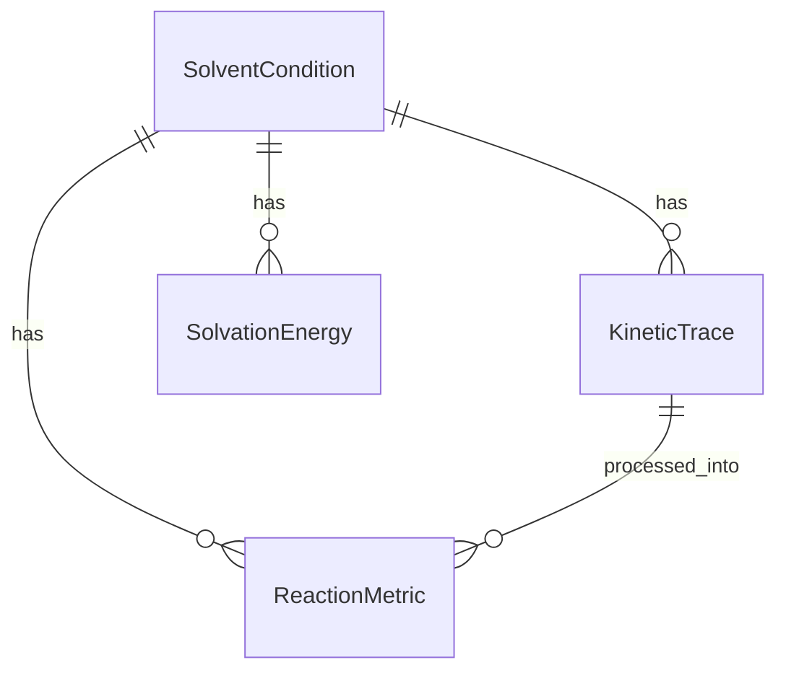

# Data Model: Solvent Effects on Photo-Fries Rearrangement Kinetics

## Overview

This document defines the data structures, schemas, and relationships for the Photo-Fries rearrangement kinetics project. All data artifacts must conform to the schemas in `contracts/` and maintain checksums in the project state file.

## Key Entities

### Solvent Condition

Represents a specific solvent environment with physical and chemical properties.

| Field | Type | Required | Description |
|-------|------|----------|-------------|
| `solvent_id` | string | Yes | Unique identifier (e.g., "cyclohexane_001") |
| `name` | string | Yes | Common solvent name |
| `dielectric_constant` | float | Yes | Dielectric constant (ε) at 25°C |
| `temperature` | float | Yes | Measurement temperature (°C), expected 25.0 ± 0.5 |
| `volume_ml` | float | Yes | Sample volume in milliliters |
| `manufacturer` | string | Yes | Chemical supplier |
| `lot_number` | string | Yes | Batch/lot identifier |
| `purity_percent` | float | Yes | Purity percentage (e.g., 99.5) |
| `purity_certificate_path` | string | Yes | Path to certificate file in `data/chemicals/` |

### Kinetic Trace

Represents raw transient-absorption data for a specific solvent and time window.

| Field | Type | Required | Description |
|-------|------|----------|-------------|
| `trace_id` | string | Yes | Unique identifier (e.g., "cyclohexane_001_run_001") |
| `solvent_id` | string | Yes | Foreign key to Solvent Condition |
| `wavelength_range_nm` | array[2] | Yes | [min_wavelength, max_wavelength] in nm |
| `time_range_ns` | array[2] | Yes | [min_time, max_time] in nanoseconds |
| `raw_data_path` | string | Yes | Path to raw CSV file in `data/raw/laser_flash_photolysis/` |
| `checksum_sha256` | string | Yes | SHA-256 hash of raw data file |
| `acquisition_timestamp` | datetime | Yes | ISO-8601 timestamp of data capture |
| `laser_pulse_intensity` | float | Yes | Pulse intensity (mJ/cm²) |

### Reaction Metric

Represents derived lifetime and product distribution values for a condition.

| Field | Type | Required | Description |
|-------|------|----------|-------------|
| `metric_id` | string | Yes | Unique identifier |
| `solvent_id` | string | Yes | Foreign key to Solvent Condition |
| `lifetime_ns` | float | Yes | Singlet-radical-pair lifetime in nanoseconds |
| `lifetime_ci_lower_ns` | float | Yes | 95% confidence interval lower bound |
| `lifetime_ci_upper_ns` | float | Yes | 95% confidence interval upper bound |
| `fit_r_squared` | float | Yes | Exponential fit quality (R²) |
| `replicate_count` | integer | Yes | Number of replicates (n ≥ 3) |
| `mean_lifetime_ns` | float | Yes | Mean lifetime across replicates |
| `std_lifetime_ns` | float | Yes | Standard deviation across replicates |
| `product_distribution` | object | No | HPLC-derived product ratios (ortho/para) |
| `analysis_timestamp` | datetime | Yes | ISO-8601 timestamp of analysis |

### Solvation Energy

Represents computed solvation free energy from DFT calculations.

| Field | Type | Required | Description |
|-------|------|----------|-------------|
| `solvation_id` | string | Yes | Unique identifier |
| `solvent_id` | string | Yes | Foreign key to Solvent Condition |
| `solvation_free_energy_kcal_mol` | float | Yes | Computed solvation free energy |
| `dft_level` | string | Yes | Theory/basis set (e.g., "B3LYP/6-31G*") |
| `solvent_model` | string | Yes | Implicit model (e.g., "SMD", "PCM") |
| `compute_input_path` | string | Yes | Path to DFT input file in `data/compute/dft_inputs/` |
| `compute_output_path` | string | Yes | Path to DFT output file |
| `checksum_sha256` | string | Yes | SHA-256 hash of output file |
| `computation_timestamp` | datetime | Yes | ISO-8601 timestamp |

## Relationships



## Data Flow

```
raw/instrument_data → KineticTrace → ReactionMetric → Correlation Analysis
raw/compute_input → SolvationEnergy → Correlation Analysis
```

## Checksum Requirements

All files under `data/` must be checksummed and recorded in:
`state/projects/PROJ-004-solvent-effects-on-photo-fries-rearrange.yaml`

Example artifact_hashes entry:
```yaml
artifact_hashes:
  data/raw/laser_flash_photolysis/cyclohexane_001/run_001.csv: "sha256:abc123..."
  data/compute/dft_inputs/cyclohexane_001.com: "sha256:def456..."
```

## Derivation Rules

- Raw data files MUST NOT be modified in place
- All transformations produce new files with documented derivation
- Derived files include provenance metadata (source file path, transformation script, timestamp)
