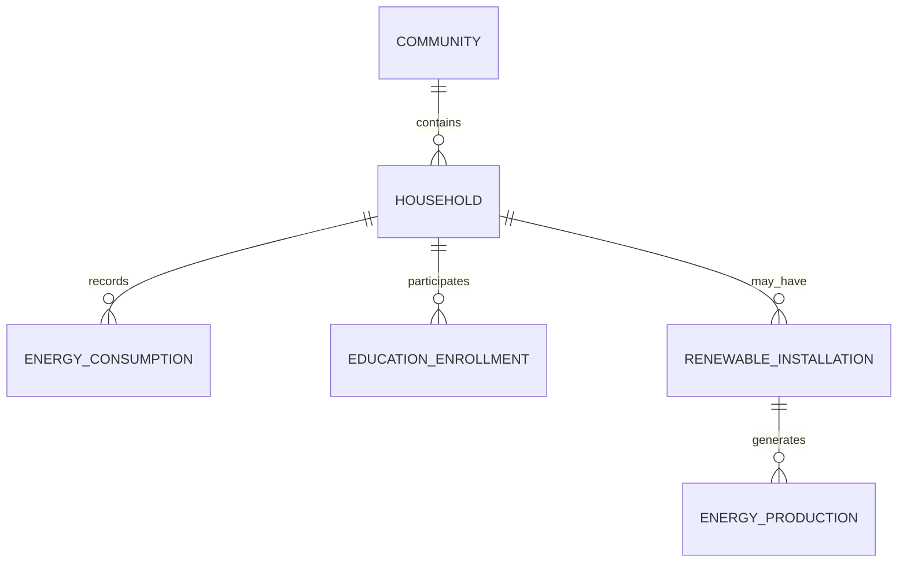

# Data Model: Developing Novel Solutions to Address Energy Inequity in Low-Income Communities

## Overview

This document defines the data structures used throughout the energy inequity analysis toolkit. All schemas are stored in `contracts/` and validated against actual data during processing.

## Entity Relationships



## Core Entities

### Household

Represents a low-income household participating in the energy inequity study.

**Location**: `contracts/household.schema.yaml`

**Key Fields**:
- `household_id` - Unique identifier (UUID)
- `income_bracket` - Annual income range category
- `household_size` - Number of residents
- `housing_type` - Owner/renter, single-family/multi-family
- `primary_heating_source` - Electric, gas, oil, other
- `energy_burden_pct` - Percentage of income spent on energy
- `community_id` - Reference to community location

### Energy Consumption

Monthly energy usage records for analysis.

**Location**: `contracts/energy_analysis.schema.yaml`

**Key Fields**:
- `household_id` - Foreign key to household
- `reporting_period` - ISO date range (YYYY-MM)
- `total_kwh` - Total kilowatt-hours consumed
- `total_cost` - Total cost in USD
- `peak_demand_kw` - Maximum demand during period
- `source_mix` - Percentage breakdown by energy source

### Renewable Installation

Records of renewable energy systems installed.

**Key Fields**:
- `installation_id` - Unique identifier
- `household_id` - Foreign key
- `technology_type` - Solar PV, wind, geothermal, etc.
- `capacity_kw` - System capacity in kilowatts
- `installation_date` - ISO date
- `annual_production_kwh` - Expected annual generation
- `financing_source` - Grant, loan, lease, cash

### Education Program Enrollment

Tracks participation in energy education initiatives.

**Key Fields**:
- `enrollment_id` - Unique identifier
- `household_id` - Foreign key
- `program_type` - Workshop, one-on-one, digital course
- `start_date` / `end_date` - Program duration
- `completion_status` - Completed, in-progress, dropped
- `pre_post_bill_avg` - Average bills before/after program

### Community

Geographic and demographic information about target communities.

**Key Fields**:
- `community_id` - Unique identifier
- `name` - Community name
- `location` - Lat/lng or address
- `median_income` - Median household income
- `poverty_rate_pct` - Percentage below poverty line
- `housing_stock_age` - Average building age
- `grid_reliability_score` - Infrastructure quality metric

## Data Flow

```
Raw Data Collection
    ↓
Data Validation (schema contracts)
    ↓
Processed Dataset
    ↓
Analysis Pipeline
    ↓
Results & Reports
```

## Validation Rules

1. **Required Fields**: All ID fields, reporting periods, and cost values are mandatory
2. **Range Constraints**: Energy burden must be 0-100%, income brackets must match predefined categories
3. **Referential Integrity**: Foreign keys must reference existing records
4. **Temporal Consistency**: End dates must be >= start dates
5. **Unit Standards**: All energy values in kWh, costs in USD, dates in ISO 8601

## Privacy & Security

1. **PII Handling**: No personally identifiable information in analysis datasets
2. **Aggregation**: Community-level reporting only for sensitive metrics
3. **Access Control**: Household-level data requires explicit consent
4. **Retention**: Raw data deleted after 2 years unless consent extended

## Schema Versioning

All schemas include a `schema_version` field. Changes follow semantic versioning:
- **MAJOR**: Breaking changes to required fields or data types
- **MINOR**: New optional fields added
- **PATCH**: Non-semantic corrections
